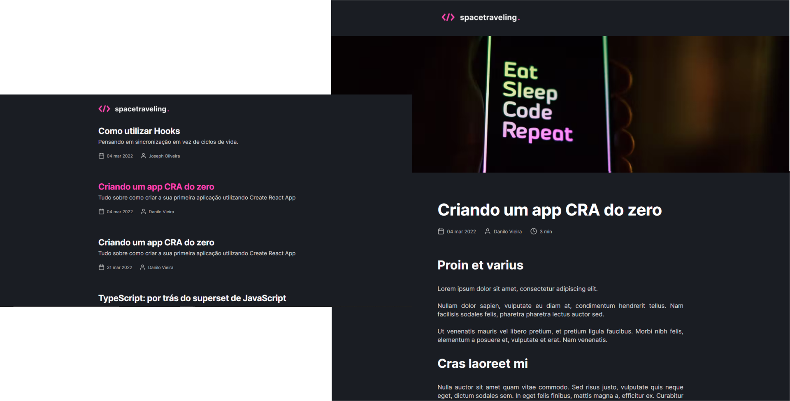

# Shop App

A challenge from the Ignite React track (Rocketseat course) that was proposed to create a blog through a prototype in figma and using Prismic as CMS.

## Screenshots



## Setup

Go to the desired folder and run

```bash
  $ git clone https://github.com/matheustsdev/spacetraveling-blog.git

  $ cd spacetraveling-blog

```

Then, install the packages and run the development server with:
(NPM)

```bash
  $ npm install

  $ npm run start
```

or: (YARN)

```bash
  $ yarn

  $ yarn start
```

And you're ready to go!

## Stack

**Front-End:** React, NextJs, Typescript, Prismic CMS, SASS and Axios

## Autor

- Github: [@matheustsdev](https://github.com/matheustsdev)
- Linkedin: [Matheus Teixeira](https://www.linkedin.com/in/matheust0105/)
